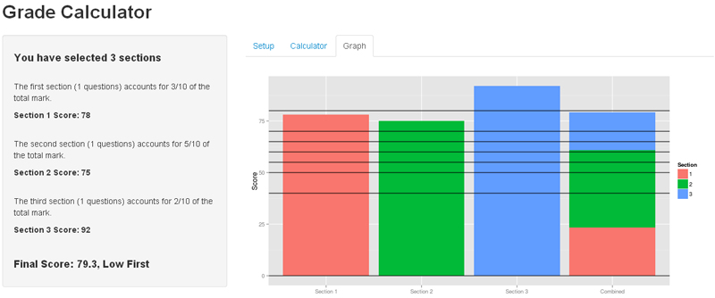

## Why make a grade calculator?

Many lecturers are expected to calculate student grades without having the mathematical training to do so, even when presented with the following equation.

$$\frac{score_1*weight_1 + score_2*weight_2 + score_3*weight_3}{weight_1+weight_2+weight_3}$$

This leads to errors and inconsistency, to which the students concerned may be oblivious.

On top of this, it saves a lot of time and effort that lecturers could be spending on their field of expertise.

--- .class #id 

## What makes a good Grade Calculator?

Surely a spreadsheet template would suffice if it's just one equation? We can get the result in R using a single line of code...


```r
s<-c(75,65,55)
w<-c(2,3,5)
(s[1]*w[1]+s[2]*w[2]+s[3]*w[3])/(sum(w[1:3]))
```

```
## [1] 62
```

This would depend on the layout remaining the same, or the user having the knowledge to change it themselves.

The formula for the final grade will vary depending on a number of factors, so The Grade Calculator includes a dedicated setup section where the user can adjust it to meet the grading criteria.

The number of sections, number of questions in each section, and the weights of each section can all be set, and grade values can be specified.

--- .class #id

## How does The Grade Calculator simplify things?

As well as performing the calculations and clearly displaying the results, The Grade Calculator will also produce a chart to graphically display which grade boundary each section falls into, as well as a stacked bar to show which proportion each section counted towards the final grade.



Visit [https://mevorama.shinyapps.io/Grade_Calculator/](https://mevorama.shinyapps.io/Grade_Calculator/) to try it out now.


